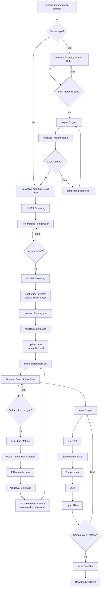
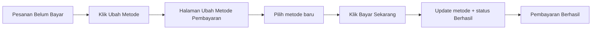

# videobelajar — ReactJS

**Live demo:** [Buka VideoBelajar](https://dickyadem.github.io/App-VideoBelajar-Reactjs/)

**Deployment Vercel:** [Open Vercel App](https://app-video-belajar-reactjs-1bax6i5hp-dickyadems-projects.vercel.app/)

Aplikasi frontend pembelajaran video berbasis ReactJS dan Vite. Mencakup katalog kelas, simulasi pembayaran, profil, kelas saya, pembelajaran, penilaian, review, dan sertifikat. Navigasi menggunakan React Router.

## Teknologi

- React 19 dan React DOM untuk antarmuka berbasis komponen.
- React Router DOM 7 untuk navigasi halaman.
- Vite 8 dan plugin React untuk development server dan build.
- CSS untuk styling dan layout responsif.
- Firebase Authentication untuk login/register dan UID yang konsisten lintas device; Context API mengelola state user, sementara `localStorage` hanya cache profil browser.
- Axios untuk konsumsi API CRUD melalui `src/services/api/` dan upload foto profil ke Cloudinary; Firebase SDK tetap digunakan sebagai sumber data utama aplikasi.
- Vitest, React Testing Library, jest-dom, dan jsdom untuk pengujian.

## Fitur

### CRUD pesanan

- **Create:** pilih metode lalu klik **Beli Sekarang** untuk menambahkan pesanan berstatus **Belum Bayar**. Checkout ulang kelas yang sama menggunakan pesanan belum dibayar yang sudah ada; kelas berstatus **Berhasil** tidak dapat dibeli ulang.
- **Read:** halaman Pesanan menampilkan judul kelas, invoice, tanggal, metode, harga dan total termasuk biaya admin. Pencarian, filter, dan pengurutan memakai data pesanan pengguna.
- **Update:** **Ubah Metode** memperbarui pesanan yang sama; **Bayar Sekarang** pada halaman pembayaran mengubah status menjadi **Berhasil** (simulasi).
- **Delete:** pesanan belum dibayar dapat dihapus melalui **Hapus Pesanan → Ya, Hapus**. **Batal** mempertahankan pesanan.

Pesanan disimpan di koleksi `orders` Firestore melalui `orderService` dan `OrdersContext`. UI menunggu konfirmasi server sebelum menampilkan sukses. Gagal menulis mempertahankan form atau konfirmasi hapus agar bisa dicoba kembali; gagal membaca menampilkan tombol muat ulang. Kepemilikan pesanan memakai UID Firebase sehingga akun yang sama dapat memuatnya lintas device.

### Fitur lainnya

- **Kelas Saya** menampilkan kelas dari pesanan berstatus Berhasil, tanpa duplikasi. Persentase dan status selesai mengikuti progres yang tersimpan di Firestore berdasarkan UID Firebase; jumlah modul serta durasi video dihitung dari kurikulum. Kelas selesai menyediakan tautan ke halaman sertifikat.

- Beranda responsif dengan hero, koleksi kelas, filter kategori, newsletter, dan footer.
- Katalog dengan pencarian berdasarkan judul, deskripsi, atau nama instruktur; filter kategori dan bidang studi; serta pilihan pengurutan harga.
- Paginasi katalog menampilkan empat kelas per halaman. Jumlah halaman mengikuti hasil pencarian/filter, dengan tombol angka serta panah sebelumnya/berikutnya. Perubahan pencarian, filter, atau urutan mengembalikan tampilan ke halaman pertama.
- Detail untuk setiap kelas: hero, deskripsi, tutor, accordion kurikulum, contoh ulasan, informasi pembelian, dan tiga rekomendasi kelas terkait.
- Kartu kelas dapat diklik untuk membuka detail. Tombol Bagikan Kelas menyalin tautan, dengan pilihan salin manual jika clipboard tidak tersedia.
- Checkout responsif dengan pilihan bank, e-wallet, dan kartu; accordion metode; ringkasan pesanan; serta tahapan Pilih Metode → Bayar → Selesai dalam simulasi lokal.
- Form Login dan Register dengan validasi HTML native, konfirmasi kata sandi, dan tombol tampil/sembunyikan kata sandi.
- Login dan register email/password menggunakan Firebase Authentication. Registrasi mengarahkan pengguna ke halaman Login tanpa otomatis masuk.
- Header dengan inisial pengguna, tombol keluar, dan menu navigasi mobile.
- Status login dipulihkan Firebase Authentication setelah halaman dimuat ulang.
- Halaman profil, pesanan, dan kelas saya.
- Halaman belajar dimulai dari Pre-Test, dilanjutkan video, rangkuman, Quiz, dan Ujian Akhir. Tombol sebelumnya/berikutnya mengikuti urutan daftar.
- Progres dinamis dan centang hijau untuk materi selesai, tersimpan di Firestore berdasarkan UID Firebase dan slug kelas; `localStorage` hanya fallback/cache.
- Pre-Test, Quiz, dan Ujian Akhir dengan daftar soal, pilihan jawaban, konfirmasi pengumpulan, hasil nilai, serta tombol ulangi yang kembali ke aturan submodul terkait.
- Download rangkuman `.txt` berisi deskripsi kelas dan daftar materi.
- Modal **Beri Review & Rating** dengan pilihan 1–5 bintang, teks review, pembatalan, dan penyimpanan lokal.
- Pop-up penyelesaian seluruh modul menuju halaman sertifikat dengan nama peserta, informasi kelas, dan download gambar SVG.
- Layout mobile untuk halaman pembelajaran dan ujian, dengan tombol sentuh, teks jawaban, serta header progres yang disesuaikan.

## Flow aplikasi

Diagram alur utama aplikasi:



Flow khusus **Ubah Metode Pembayaran**:



Pada flow ubah metode, tidak dibuat order baru. Order yang sama diperbarui dengan metode baru dan status `Berhasil`.

### Autentikasi

1. Pengunjung dapat membuka beranda, katalog, dan detail kelas tanpa login.
2. Halaman yang membutuhkan akun, seperti pembayaran, pesanan, kelas saya, belajar, ujian, profil, dan sertifikat, mengarahkan pengunjung ke `/#/login`.
3. Pengguna baru membuka `/#/register`, mengisi nama, email, nomor HP, kata sandi, dan konfirmasi kata sandi.
4. Firebase Authentication membuat akun, kemudian aplikasi mengarahkan pengguna ke Login. Registrasi tidak langsung membuat sesi login.
5. Setelah login berhasil, Firebase mengirim UID melalui `onAuthStateChanged`. Profil user disimpan atau dibaca dari `users/{uid}` Firestore dan sesi dipulihkan saat halaman dimuat ulang.
6. Jika kredensial salah, provider belum aktif, atau koneksi gagal, form menampilkan pesan error Firebase yang sesuai.

### Pembelian kelas baru

1. Dari detail kelas, klik **Beli Sekarang** untuk membuka `/#/course/:slug/payment`.
2. Pilih satu metode pembayaran pada accordion bank, e-wallet, atau kartu. Klik pada seluruh baris metode, bukan hanya radio atau logonya.
3. Klik **Beli Sekarang**. Aplikasi membuat satu dokumen `orders` berstatus **Belum Bayar**, lalu membuka `/#/course/:slug/pay?order=...&method=...`.
4. Halaman pembayaran menampilkan virtual account demo, ringkasan pesanan, biaya admin Rp7.000, instruksi pembayaran, dan tombol **Bayar Sekarang**.
5. Klik **Bayar Sekarang**. Aplikasi mengubah status order menjadi **Berhasil**, menambahkan `status=success` pada URL, dan menampilkan **Pembayaran Berhasil!**.
6. Klik **Lihat Detail Pesanan** untuk membuka Pesanan Saya. Order berhasil juga menjadi sumber Kelas Saya.
7. Jika kelas sudah memiliki order berstatus **Berhasil**, checkout menampilkan **Kelas Sudah Dibeli** dan tautan **Buka Kelas Saya**, tanpa membuat order duplikat.

### Mengubah metode pembayaran

Flow ini berlaku hanya untuk order berstatus **Belum Bayar**.

1. Buka Pesanan Saya dan klik **Ubah Metode** pada order yang belum dibayar.
2. Halaman membuka `/#/course/:slug/payment?change=1&order=...` dengan judul **Ubah Metode Pembayaran**.
3. Pilih metode baru, misalnya dari **Bank BNI** ke **Bank BRI**.
4. Klik **Bayar Sekarang**. Dalam mode `change=1`, aplikasi memperbarui metode dan status menjadi **Berhasil** dalam satu operasi pada order yang sama.
5. Aplikasi langsung membuka URL pembayaran dengan `status=success` dan menampilkan **Pembayaran Berhasil!**. Tidak ada ringkasan checkout kedua dan tidak dibuat order duplikat.

### Pesanan dan kegagalan operasi

- **Lanjutkan Pembayaran** membuka kembali instruksi pembayaran untuk order **Belum Bayar**.
- **Hapus Pesanan** meminta konfirmasi. **Ya, Hapus** menghapus order; **Batal** mempertahankannya.
- Loading memblokir aksi berulang sampai operasi server selesai.
- Jika pembacaan gagal, UI menampilkan error dan tombol coba lagi.
- Jika penulisan gagal, form atau order tetap dipertahankan agar pengguna dapat mengulangi operasi.
- Semua operasi order memeriksa UID pemilik pada service Firebase. Status pembayaran di aplikasi ini adalah simulasi, bukan transaksi uang nyata.

### Flow belajar sampai sertifikat

1. Dari Kelas Saya, buka kelas berstatus **Berhasil**.
2. Selesaikan Pre-Test, video, rangkuman, Quiz, dan Ujian Akhir sesuai urutan modul.
3. Video ditandai selesai melalui tombol berikutnya; membuka item sidebar saja tidak menyelesaikan materi.
4. Quiz dan Ujian Akhir membutuhkan nilai minimal 60. Setelah seluruh materi selesai, dialog penyelesaian muncul.
5. Klik **Ambil Sertifikat**, lalu **Download Sertifikat** pada halaman sertifikat.

### Data katalog, profil, dan media

- Katalog dan metode aktif dibaca dari Firestore saat aplikasi dimuat. Katalog lokal hanya digunakan sebagai fixture dan seed manual.
- Semua service pemanggilan backend berada di `src/services/api/`: `authService`, `catalogService`, `courseApi`, `orderService`, `profileService`, `progressService`, `seedService`, dan `cloudinaryService`.
- `courseApi.js` menjadi service course Firebase dan menyediakan pembacaan katalog serta operasi CRUD course.
- Foto profil diunggah ke Cloudinary. Jika URL foto gagal dimuat, Header dan halaman Profil menampilkan inisial user sebagai fallback.
- Progress tersimpan di Firestore berdasarkan UID dan slug kelas; review dan sertifikat masih lokal.

### Batasan saat ini

Katalog kelas berasal dari Firestore melalui `catalogService`; `src/data/` dipakai sebagai fixture/seed dan data demo pendukung. Autentikasi email/password menggunakan Firebase Authentication; newsletter masih berupa simulasi frontend tanpa backend dan tidak mengirim email. Tombol Google SSO, pemulihan kata sandi, dan filter Harga/Durasi belum memiliki fungsi lengkap.

Tombol beli pada detail membuka metode pembayaran. Checkout merupakan simulasi tanpa payment gateway, pembayaran, atau pendaftaran kelas. Tidak ada data kartu yang diminta. Biaya admin tetap Rp7.000 adalah contoh untuk demo. Harga detail dan checkout mengikuti harga katalog.

Kurikulum, profil tutor, ulasan, dan soal ujian menggunakan konten demo. Pemutar video belum memutar materi asli; progres video dicatat ketika berpindah lewat tombol next di bawah. Rangkuman merupakan deskripsi dan daftar materi, bukan transkrip video. Sertifikat SVG dibuat lokal dan belum diverifikasi atau diterbitkan oleh server.

Progres belajar disimpan ke Firestore berdasarkan UID Firebase dan slug kelas, sehingga dapat dipulihkan lintas perangkat. `localStorage` hanya fallback/cache browser; review masih lokal dan belum tersinkron antarperangkat. Proteksi route dan kelulusan di frontend bukan pengamanan backend.

## Menjalankan secara lokal

Salin `.env.example` menjadi `.env.local`, lalu isi variabel `VITE_FIREBASE_*` dari Firebase Console > Project settings > Your apps. Aktifkan provider **Email/Password** di Firebase Authentication. Isi `VITE_CLOUDINARY_CLOUD_NAME` dan `VITE_CLOUDINARY_UPLOAD_PRESET` dari Cloudinary untuk upload foto profil. Gunakan upload preset mode **Unsigned**; jangan masukkan API Secret ke frontend. File `.env.local` diabaikan Git. Restart development server setelah mengubah nilainya.

Untuk Vercel, tambahkan variabel dengan nama dan nilai yang sama melalui **Settings > Environment Variables** pada environment deployment yang digunakan, lalu deploy ulang. Konfigurasi `vercel.json` sudah mengatur build Vite dengan base `/` dan output `dist`.

Workflow GitHub Pages membaca keenam variabel dari GitHub **Settings > Secrets and variables > Actions > Variables**. Isi variabel tersebut jika masih memakai deployment GitHub Pages.

Variabel `VITE_*` masuk ke bundle browser, sehingga hanya digunakan untuk konfigurasi Firebase client. Jangan menyimpan service-account/private key di sini; akses database tetap diatur melalui Firebase Authentication dan Security Rules.

Gunakan Node.js `20.19+` pada versi 20, atau `22.12+`, serta npm sesuai persyaratan Vite yang terpasang.

Dari direktori proyek, jalankan:

```sh
npm ci
npm run dev
```

Buka alamat yang ditampilkan Vite di terminal. Aplikasi saat ini tidak memerlukan konfigurasi `.env`.

Di PowerShell, jika `npm.ps1` diblokir execution policy, gunakan `npm.cmd` sebagai pengganti `npm`.

| URL | Halaman |
| --- | --- |
| `/` | Beranda dan koleksi kelas |
| `/category` | Katalog, pencarian, dan filter kelas |
| `/course/:slug` | Detail kelas, misalnya `/course/design-thinking-praktis` |
| `/course/:slug/payment` | Pilihan metode pembayaran dan simulasi checkout untuk kelas tersebut |
| `/course/:slug/pay` | Instruksi pembayaran dan hasil pembayaran demo |
| `/profile` | Profil pengguna |
| `/orders` | Pesanan pengguna |
| `/classes` | Kelas saya |
| `/learn/:slug` | Submodul belajar, rangkuman, dan progres |
| `/learn/:slug/pretest` | Soal dan hasil Pre-Test |
| `/learn/:slug/quiz` | Soal dan hasil Quiz |
| `/learn/:slug/exam` | Soal dan hasil Ujian Akhir |
| `/course/:slug/certificate` | Pratinjau dan download sertifikat setelah seluruh modul selesai |
| `/login` | Form masuk |
| `/register` | Form pendaftaran |

Halaman pembayaran, profil, pesanan, kelas saya, belajar, ujian, dan sertifikat memerlukan login Firebase.

## Menguji alur belajar sampai sertifikat

1. Login, kemudian buka `/learn/big-4-auditor-financial-analyst`.
2. Klik **Mulai Pre-Test**, lalu kumpulkan melalui **Selesaikan → Selesai**. Pengumpulan Pre-Test dihitung selesai tanpa syarat nilai.
3. Kembali ke halaman belajar, pilih video pertama, dan gunakan tombol **next di bagian bawah** untuk melewati setiap video. Memilih video dari sidebar saja belum menandainya selesai.
4. Pada submodul Rangkuman, klik **Download Rangkuman** untuk mencatat penyelesaian.
5. Kerjakan Quiz dan Ujian Akhir dengan nilai minimal **60**. Untuk pengujian data demo saat ini, opsi pertama adalah jawaban benar pada setiap soal.
6. Setelah semua selesai, progres kelas contoh menjadi **11/11** (7 video, Pre-Test, rangkuman, Quiz, dan Ujian Akhir). Jumlah mengikuti data kelas, bukan angka tetap.
7. Pop-up **Modul sudah selesai** muncul. Klik **Ambil Sertifikat** untuk membuka halaman sertifikat, lalu **Download Sertifikat** untuk mengunduh SVG.

Centang hijau menunjukkan materi selesai; latar hijau menunjukkan materi yang sedang dipilih. Ringkasan progres dibuka dengan mengklik angka progres di header dan ditutup dengan klik di luar, Escape, atau klik tombol lagi.

Tombol **Ulangi** kembali ke aturan Pre-Test/Quiz/Ujian Akhir yang sesuai. Memulai lagi mengosongkan jawaban percobaan, tetapi tidak menghapus progres modul yang sebelumnya selesai.

Untuk menguji review, klik **Beri Review & Rating**, pilih bintang dan isi review, lalu klik **Selesai**. Buka kembali untuk memeriksa hasil tersimpan. **Batal** membuang perubahan yang belum disimpan.

Untuk mengulang progres dari nol, hapus dokumen `users/{uid}/progress/{courseSlug}` dari Firestore. `localStorage` hanya menyimpan fallback/cache progres. Review masih memakai key `videobelajar-review:<nama>:<slug>` di browser.

## Pengujian dan build

### GitHub Pages

Konfigurasi build menggunakan base `/App-VideoBelajar-Reactjs/` dan `HashRouter` agar route bisa dimuat ulang di hosting statis. URL aplikasi menggunakan `/#/`, misalnya `https://dickyadem.github.io/App-VideoBelajar-Reactjs/#/category`. Saat development gunakan alamat Vite dengan `/#/learn/...` untuk membuka halaman belajar langsung.

1. Push perubahan proyek ke branch `main`.
2. Buka repository → **Settings → Pages**, lalu pilih **GitHub Actions** sebagai Source.
3. Workflow `.github/workflows/deploy.yml` menjalankan instalasi, tes, build, dan deploy. Bisa dijalankan ulang melalui **Actions → Deploy to GitHub Pages → Run workflow**.
4. Setelah workflow berhasil, buka `https://dickyadem.github.io/App-VideoBelajar-Reactjs/`.

Hasil build berada di `dist/`; folder ini tidak perlu di-commit. Jika nama repository berubah, sesuaikan `base` di `vite.config.js`. Panduan: [Deploy Vite ke GitHub Pages](https://vite.dev/guide/static-deploy#github-pages).

### Perintah

```sh
# Menjalankan pengujian sekali
npm test

# Membuat hasil build produksi di dist/
npm run build

# Menguji bagian belajar dan sertifikat saja
npm test -- src/pages/LearningPage.test.jsx src/pages/QuizPage.test.jsx src/components/CourseProgress.test.jsx src/components/ReviewButton.test.jsx src/pages/CertificatePage.test.jsx

# Meninjau hasil build secara lokal
npx vite preview
```

Konfigurasi pengujian ada di `vite.config.js`, dengan setup di `src/test/setup.js`. File pengujian ditempatkan di dekat halaman, komponen, konteks autentikasi, dan data yang diuji.

## Struktur proyek

```text
videobelajar/
├── src/
│   ├── main.jsx          # Entry point, router, provider, dan impor CSS
│   ├── App.jsx           # Definisi route aplikasi
│   ├── App.test.jsx      # Pengujian aplikasi
│   ├── components/       # Header, Footer, CourseProgress, ReviewButton, form, dll.
│   ├── context/          # AuthContext, CatalogContext, OrdersContext
│   ├── hooks/             # Hook async resource dan progres belajar
│   ├── services/api/      # Semua service pemanggilan Firebase dan Cloudinary
│   ├── data/             # Data kelas dan pengujiannya
│   ├── pages/            # Katalog, checkout, belajar, Quiz, Certificate, dan pengujian
│   └── test/setup.js     # Setup lingkungan pengujian
├── assets/css/           # Stylesheet yang diimpor oleh aplikasi React
├── public/assets/        # Logo dan ikon statis
├── index.html            # HTML utama dengan root aplikasi React
├── vite.config.js        # Konfigurasi Vite dan Vitest
├── package.json          # Dependency dan script npm
├── package-lock.json     # Versi dependency terkunci
├── .gitignore
└── README.md
```

File HTML dan JavaScript versi lama diarsipkan dalam `legacy/` dan tidak termasuk entry build React. Aset CSS dan gambar yang masih diimpor React tetap berada di `assets/`. Halaman aplikasi React berada di `src/pages/` dan diakses melalui route di atas. Gambar kelas dan avatar instruktur dimuat dari layanan eksternal sehingga memerlukan koneksi internet.

## Mengelola detail kelas

Semua kelas menggunakan satu template `src/pages/CourseDetailPage.jsx` dengan styling di `assets/css/course-detail.css`. Interaksi pembelian dan bagikan berada di `src/components/PurchaseCard.jsx`. Tidak perlu membuat halaman baru untuk setiap produk.

1. Ubah informasi katalog di koleksi `courses` Firestore. Setiap kelas memiliki `slug` unik dan tetap sebagai bagian URL; pertahankan slug ketika hanya mengganti judul.
2. Kelola konten terkait pada koleksi `modules`, `lessons`, dan `reviews` sesuai relasi yang dibaca `courseService`. File `src/data/courseDetails.js` hanya fixture/seed demo.
3. Kartu kelas otomatis menuju `/course/:slug`. Jumlah video dihitung dari daftar pelajaran dan jumlah dokumen demo mengikuti jumlah modul.
4. Jalankan `npm test` dan `npm run build` setelah perubahan. Slug yang tidak ditemukan menampilkan tautan kembali ke katalog.

## Mengelola metode pembayaran

- Harga kelas berasal dari koleksi `courses` Firestore dan dinormalisasi menjadi `priceAmount`; label harga katalog dan perhitungan checkout berasal dari nilai tersebut.
- Metode aktif dibaca dari koleksi `paymentMethods` Firestore. Biaya admin demo dan pemetaan logo berada di `src/data/paymentMethods.js`. Pengguna harus memilih satu metode sebelum checkout.
- `src/components/PaymentMethods.jsx` menangani pilihan dan accordion. `src/pages/PaymentMethodPage.jsx` menangani ringkasan dan tahapan simulasi, dengan styling di `assets/css/payment-method.css`.
- Alur pembayaran memakai `PaymentMethodPage.jsx` untuk pemilihan metode dan `PaymentPage.jsx` untuk instruksi serta hasil pembayaran demo. Status pesanan tersimpan di Firestore dan dimuat kembali setelah refresh.
- Ringkasan kelas berada di kanan pada desktop dan di atas pilihan metode pada mobile; gambar kelas disembunyikan pada mobile. Logo metode pembayaran memakai aset PNG lokal di `assets/images/`, termasuk bank, e-wallet, Mastercard, VISA, dan JCB.


## Batas keamanan dan integrasi

- `VITE_FIREBASE_*` adalah konfigurasi SDK client yang terlihat di bundle browser. `.env` memisahkan konfigurasi, bukan menyembunyikan kredensial dari pengguna.
- Firebase Authentication menyediakan UID lintas device. Route guard dan validasi pemilik di client bukan pengganti Security Rules; rules Firebase tetap harus membatasi akses berdasarkan `request.auth.uid`.
- Sebelum memakai data pribadi/transaksi nyata, integrasikan Firebase Authentication dan verifikasi kepemilikan menggunakan `request.auth.uid` di Security Rules. Harga dan status pembayaran nyata harus ditentukan oleh backend/payment provider tepercaya.
- Service profil hanya mengirim UID, nama, email, nomor HP, URL foto Cloudinary, role demo, dan timestamp. Password, foto base64, dan daftar pesanan tidak dikirim. Progres belajar tersinkron di Firestore; review dan sertifikat masih lokal.
- Jangan menaruh service-account key, token privat, atau secret backend pada variabel `VITE_*`.

## Pola async dan performa

`src/hooks/useAsyncResource.js` menyatukan loading, pesan kegagalan, retry, dan pengabaian response lama untuk katalog/pesanan. Error mutasi tidak menggantikan error pemuatan. Status sinkronisasi profil tersedia di halaman profil. Halaman belajar, kuis, dan sertifikat memakai lazy loading dengan fallback serta error boundary; gambar kartu kelas dimuat secara lazy. Firebase tetap memuat SDK pada bundle awal, sehingga optimasi ini tidak menjamin seluruh bundle di bawah 500 kB.
